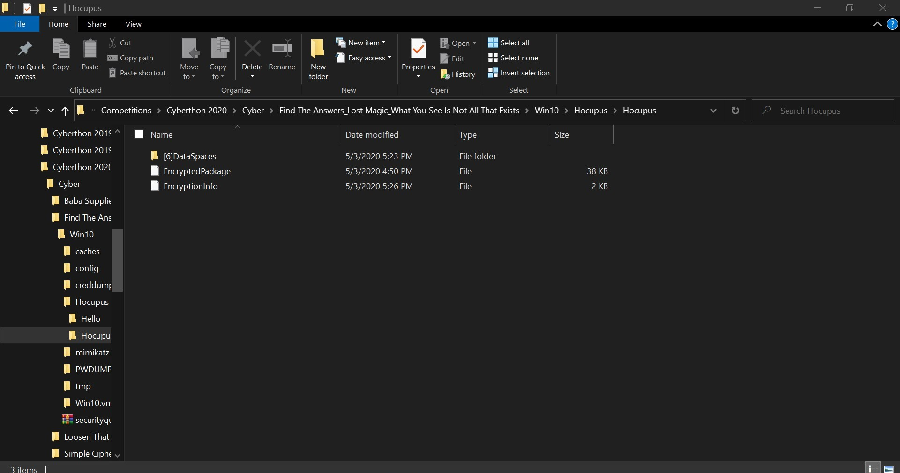

# Lost Magic

## 750 Points // 0 solves // *Not solved during the competition*

**The attackers have corrupted an important password-protected document by modifying one of the crypto parameters. To make matters worse, they have also deleted the file containing the document's password. The owner of the document recalls using 'M' as one of the password characters. He also has a tendency of selecting 4-char passwords with a character from each of the four known character sets. Can you recover the document?**

Extracting the document (hocuspocus.docx) from the VM, we notice that it is a password protected word **<u>2010</u>** document. (<u>Note:</u> The version is important as each version uses [different encryption](https://en.wikipedia.org/wiki/Microsoft_Office_password_protection). Word 2010 uses AES 128-bit key with SHA-1)

If we try to enter any password into the document, word throws out an error saying the file is damaged, just as the challenge stated.

Hence, the first step will be to try and fix this word file. But how in the world do we do that? Having no prior knowledge of fixing corrupted word documents, we can create another 2010 word document to compare and try to find out what is corrupted.

## Sidetracked

*Skip to the actual solution if you are in a rush, but there is a useful "tool" which can help us with the fixing here*

Initially, we compared the docx to a 2019 docx file which employed a different encryption, and hence we did not fix the docx properly. But somehow, Microsoft Word was no longer complaining about any errors, so we thought that the docx was properly fixed. 

Also, instead of using Hashcat as hinted (quite obviously) in the VM, we went to write our own python script, (which was unsurprisingly, horrendously slow and didn't crack anything). 

### Useful "tool": 

In the process of writing the python script, we employed a library called `msoffcrypto-tool`. When we try to open the file, the xml parser will throw an <u>**xml error**</u>.  Hence this suggests that there is something wrong with the XML inside the docx.

## Actual Solution

Now we can always try comparing the things in a hex editor, but after doing that for sometime with no result, I decided to just unzip the docx to have a better view of the XML in Notepad++.

Unzipping the docx, for both our test docx and the challenge docx, we see these files:



After some poking around, we find the XML in `EncryptionInfo`.

Comparing it in a diff checker:


Aha! Apart from the different keys and salts, the `spinCounts` seems to be different, and there is an additional `Q` at the back of the XML.

After removing them, both Microsoft Word & msoffcrypto-tool no longer complained of any errors, yay!

## Cracking

Now that the docx is fixed, it's cracking time!

Drawing from HCI_Jiayang's enlightenment that Hashcat can be ran on Google Colab instead of my amazing Intel UHD Graphics and [this amazing article](http://stuffjasondoes.com/2018/07/18/cracking-microsoft-office-document-passwords-for-free-using-hashcat/) on cracking docx files, we can solve it at (amazing) speeds.:smile:

But first, we need to extract the hash from the docx using `office2john.py`, which will return:

```
hocuspocus.docx:$office$*2010*100000*128*16*8952ebc27affc2683516b08755874ee0*7db90fc39d02d0fdc58ba9965ec7ff2a*9113e517ed99ac0a6c975e7a3f24b2d286413b653fc7dd8a83faaf8c59e10105
```

Now, as stated in the article, hashcat **only wants the hash part**, so let's remove `hocuspocus.docx`:

```
$office$*2010*100000*128*16*8952ebc27affc2683516b08755874ee0*7db90fc39d02d0fdc58ba9965ec7ff2a*9113e517ed99ac0a6c975e7a3f24b2d286413b653fc7dd8a83faaf8c59e10105
```

Time to crack it using hashcat! We will need to install hashcat in Google Colab, and most importantly, **connect to a GPU runtime**.

Instead of using a wordlist in the article, we will be using a simple mask:

```bash
!hashcat -m 9500 -a 3 -o passwd /content/officepassword.hash -1 M?l?s?d ?1?1?1?1

CUDA API (CUDA 10.1)
====================
* Device #1: Tesla K80, 11373/11441 MB, 13MCU

OpenCL API (OpenCL 1.2 CUDA 10.1.152) - Platform #1 [NVIDIA Corporation]
========================================================================
* Device #2: Tesla K80, skipped

Minimum password length supported by kernel: 0
Maximum password length supported by kernel: 256

Hashes: 1 digests; 1 unique digests, 1 unique salts
Bitmaps: 16 bits, 65536 entries, 0x0000ffff mask, 262144 bytes, 5/13 rotates

..... #After some time...

Session..........: hashcat
Status...........: Cracked
Hash.Name........: MS Office 2010
Hash.Target......: $office$*2010*100000*128*16*8952ebc27affc2683516b08...e10105
Time.Started.....: Sun May  3 12:57:55 2020 (20 mins, 10 secs)
Time.Estimated...: Sun May  3 13:18:05 2020 (0 secs)
Guess.Mask.......: ?1?1?1?1 [4]
Guess.Charset....: -1 M?l?s?d, -2 Undefined, -3 Undefined, -4 Undefined 
Guess.Queue......: 1/1 (100.00%)
Speed.#1.........:    14790 H/s (8.99ms) @ Accel:8 Loops:128 Thr:1024 Vec:1
Recovered........: 1/1 (100.00%) Digests #Yay!
Progress.........: 17891328/24010000 (74.52%)
Rejected.........: 0/17891328 (0.00%)
Restore.Point....: 212992/343000 (62.10%)
Restore.Sub.#1...: Salt:0 Amplifier:27-28 Iteration:0-1
Candidates.#1....: o;M* -> ohn|
Hardware.Mon.#1..: Temp: 73c Util: 98% Core: 810MHz Mem:2505MHz Bus:16

Started: Sun May  3 12:57:46 2020
Stopped: Sun May  3 13:18:06 2020

```

 Hmm... maybe I should have done the GPU optimisations mentioned by Jiayang. But after a wholesome 21 mins, the hash was cracked, revealing the password below:

```bash
$office$*2010*100000*128*16*8952ebc27affc2683516b08755874ee0*7db90fc39d02d0fdc58ba9965ec7ff2a*9113e517ed99ac0a6c975e7a3f24b2d286413b653fc7dd8a83faaf8c59e10105:oM3!

oM3!
```

Entering the password into the docx reveals the flag:

```
Cyberthon{bibbidi_bobbidi_boo}
```


## Takeaways:

- Hashcat cracking can be done on Google Colab. (That's broken!)
- How to fix corrupted & encrypted docx files (Tbh, comparing the difference probably works for any type of file, you are just analysing the structure)
- Docx files have different encryptions for different versions