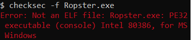
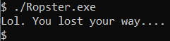
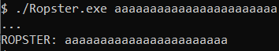
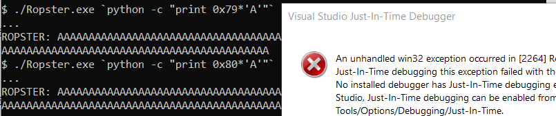
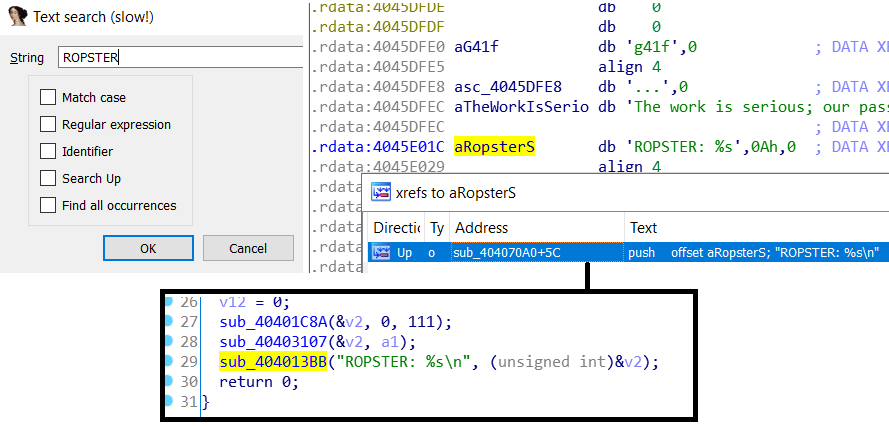
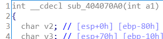
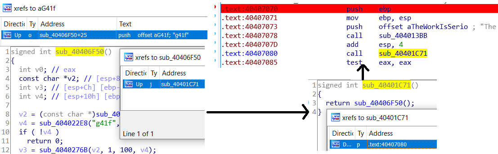
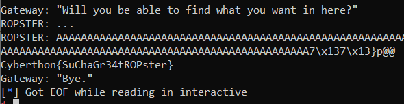

# Cyberthon: CSIT

##### The ROPster [1500]

_You have found an artefact left behind by the attacker. Now is your chance to RE the executable. Only those who exploit it successfully will obtain the hidden flag._

`nc 128.199.181.212 8123`

Files: `Ropster.exe`

#### Poking around

As it's namesake, `The ROPSter` is a Return-Oriented-Programming pwn challenge. ROP is something I've tackled often in linux, but it's rare to see one involving an `.exe`.

Regardless, every binary exploitation challenge starts with 3 simple things:

1. `checksec`, which is unfortunately not an option:
2. IDA Pro, which is unfortunately rather unhelpful: 
3. Running random inputs on the binary, which is evidently the only option

So. We'll start off straight by running the bare exe: 

`stdin` is clearly unavailable, so the only alternate source of input must be `argv`:



And if you give an input that's long enough (`0x80`), you'll see the Windows equivalent of a segfault:



We now know that the binary requires a buffer overflow through `argv`<sup>1</sup>. Where do we go from here?

#### Interactive Disassembly

The decompiled output for `Ropster.exe` is pretty terrible by default. IDA Pro can't guess the function labels on it's own, and we'll have to find out where execution starts on our own.

To find a reference to `argv`, we'll search for the string that's printed along with it, `"ROPSTER:"`:



We can make a couple of deductions.

* `sub_4040133BB` is essentially `printf()`, taking in `argv` from `v2`. At the start of the function definition, `v2` is located at `[ebp-80h]`, so the buffer takes in 0x80 chars of input before Bad Stuff happens, as empirically found earlier on.



* The variable `g41f` is probably an actual flag on server-side. This tells us where we need to jump:



So if we model the stack something like,

```
+---------buffer---------|-------sp-------|-return pointer-|
|        'A'*0x80        | <random_value> |   0x4040707D   |
<-----------80-----------|-------04-------|-------04-------|
```

We'll get the flag printed immediately.



Incidentally, this makes the challenge a simple `ret2text`, rather than a full-blown exercise in ROP. Perhaps an unintended solution?

#### Flag

`Cyberthon{SuChaGr34tROPster}`

#### Code

This payload will not work for `argv` input.<sup>2</sup>

```python
from pwn import *
payload = 'A'*0x80 + p32(0x13371337) + p32(0x4040707D)
r = remote('128.199.181.212', 8123)
r.sendline(payload)
r.interactive()
```

#### Footnotes

1. Naturally, `argv` isn't accessible server-side. Presumably, the `stdin` of the server is getting piped as an argument.
2. Presumably, something in windows is messing with attempts to run the exploit on `Ropster.exe` locally.
