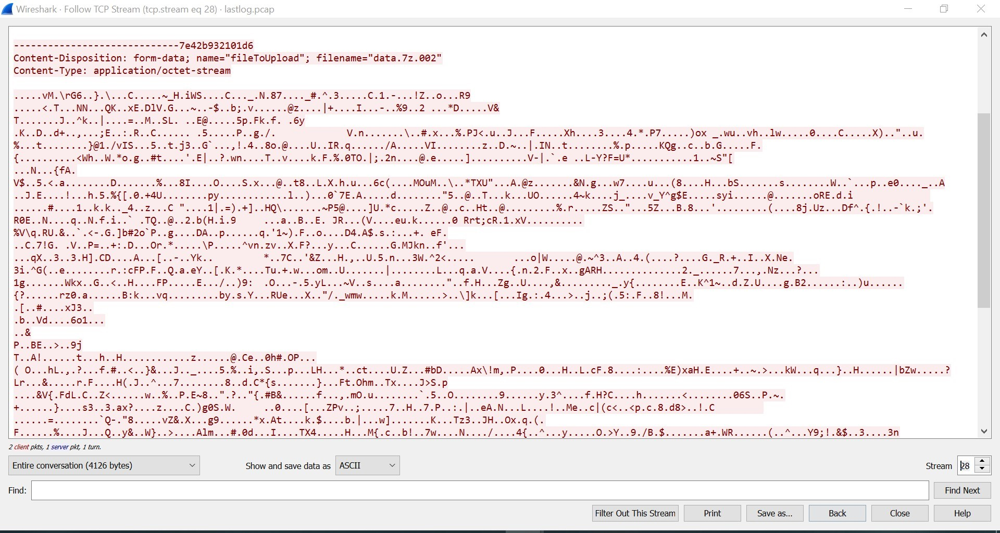
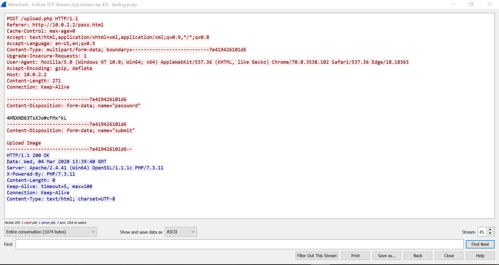

## What was leaked
#### Network Security // 160 Points // 13 Solves

### Challenge description
The attacker zipped large amounts of data into a .7z file and posted them offsite through an unsecured connection to a file sharing site. We managed to collect the packets and the password he sent, find out what whas leaked!

### Solution
The challenge gave us a pcap traffic capture of some traffic, with the hints provided in the challenge, we know that we need to look for a big file.

Opening up wireshark and sorting the packets by length, we see that there is a `/upload.php ` endpoint with considerable amounts of data going through.

The capture included a multipart/form-data, which means it had **multiple files arranged by their file names**. We see that the largest one has a data.7z.002 file, and it is a part of a larger file from the other 2 post requests to `upload.php` endpoint which contain `data.7z.001` and `data.7z.003`.



Conbining these hex data together into one file from the three files (`data.7z.001`, `data.7z.002` and `data.7z.003`), we obtain a 7zip file. However, a password is required for extraction. Luckily for us, the password could be found being uploaded to the `/upload.php` endpoint with a `name="password"`  a couple of streams down (`4H%XND63TsXJo#cFMx^kL`). 



Opening up the extracted file gave us a text file with the lorem ipsum placeholder text, but this can be simply resolved by searching the file for the flag header, which we then obtain the final flag.

```
Cyberthon{D4t48r3@ch!!11!one}
```


### Key takeaways
- Don't be mislead by the other data in the capture as the challenge clearly stated it was in unencrypted traffic and therefore it is just http
