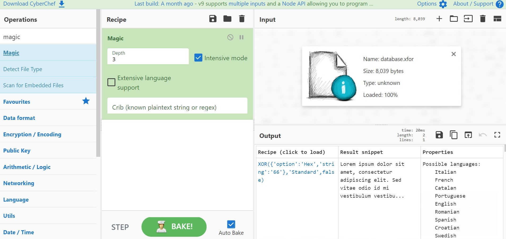

# Simple Cipher 

------

#### Operating System // 140 points // 4 Solves

**You managed to intercept some encrypted data from the attacker's server but it seems like the attacker has used his own algorithm...**

We are given a file named `database.xfor`

Taking a look at it seems to show that it is encrypted with some sort of "advanced"  cipher due to the many unprintable characters there are.

However, xfor reminded me of "xor", and the numerous challenges of xor "encrypted" files which make a seemingly encrypted file which can be decoded very easily with **Cyberchef**!

Anddd yup, dumping it into cyberchef gave the result:

## 

### Takeaways:

- Cyberchef works magic :happy: