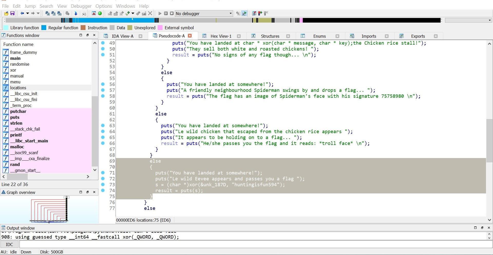
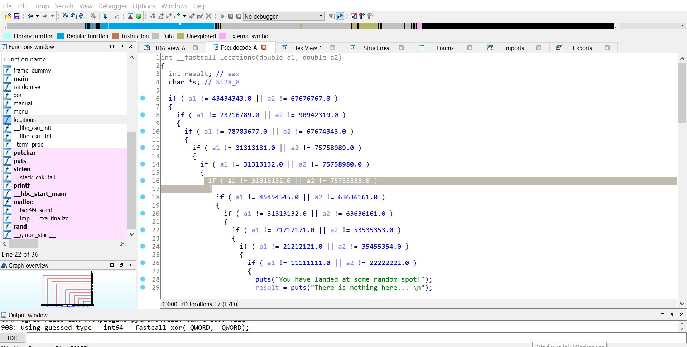

# Treasure Hunt

------

**ShoppingBaba holds an annual treasure hunt acitivity by letting players play a game to hunt for items in the game.**

**Winners that find items in the game will stand a chance to win items in the event. However the program have been changed!!**

**Help ShoppingBaba investigate and find the ultimate prize in the game!**


We are given an ELF64: `map`

We are greeted with a "game" after running the ELF:

```bash
./map
Welcome to ShoppingBaba's Annual Treasure Hunt game!
Look for the flag hidden in this Treasure to win points!In this game, you can either navigate in ShoppingBaba center by the following ways:

1: Move to a random spot
2: Teleport to a known coordinate
9: Exit the Treasure Hunt

Please enter the option to move around:
```

I then iterated through all the options provided in menu 2, but it seemed to be a dead end.

After a while, I decided to just pop this bad boy into IDA Pro. 

We are looking for a specific coordinates which we can move to and hence the flag will be printed.

After some snooping around, I found the code that prints the flag, and the corresponding condition (coordinates) to print it:





Hence, we have to move to the coordinates `31313132.0`, `75753333.0`, and tada!

```
You have landed at somewhere!
Le wild Eevee appears and passes you a flag
Cyberthon{treasure_hunt_baba}
```

Thus the flag is:

```
Cyberthon{treasure_hunt_baba}
```


### Takeaways:

- Not all "game" challenges can be solved easily without breaking them a bit


