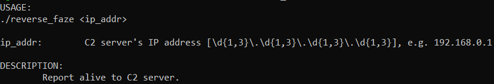
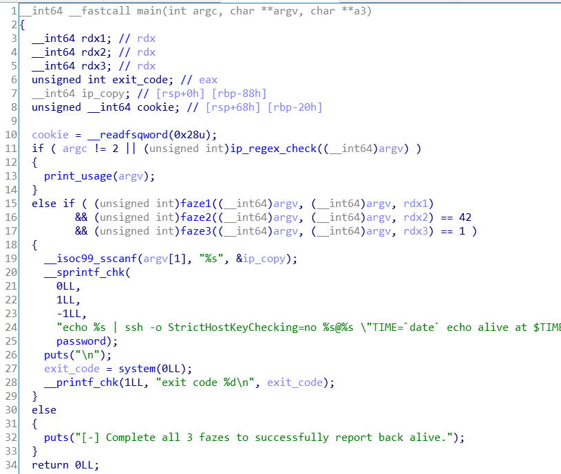
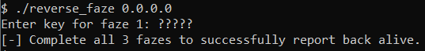
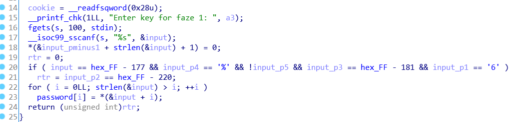
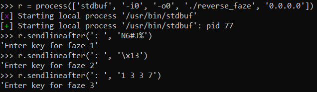
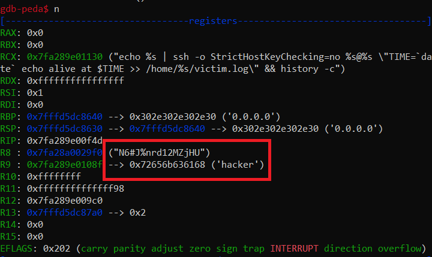
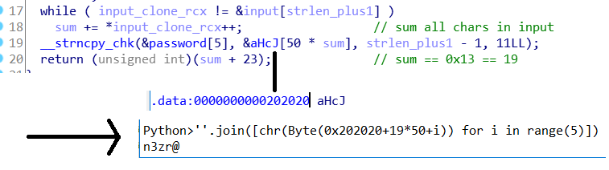
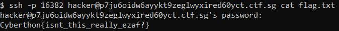

# Cyberthon: Operating Systems

## Reverse(Faze) [1000]

_The hacker left a binary executable behind in ShoppingBaba's server as a way to connect back to their C2 server's ssh service at p7ju6oidw6ayykt9zeglwyxired60yct.ctf.sg:16382_

_Please help to find the credentials left behind inside the binary executable and find the flag on the hacker's server!_

**Files**: [reverse_faze](https://api.csdc20f.ctf.sg/file?id=ck8zooi6o00p207762gfblm2r&name=reverse_faze)

### Taking Off

 
<i>Regex is a dour to the eyes, sometimes.</i>

We're going to skip the description and dive right into Hex-Rays.

I've taken the liberty of renaming a couple of variables to make the code a little bit more readable.

The binary is a simple crackme with 3+1 distinct `faze`s. First, we pass a valid IP through `argv` to actually get to the first phase:

Which runs on this code:

Normally, you'd use something like `angr` to escape the tedium of manual RE1.

My team was rather stuffed for time during the competition, and the binary was short enough to eyeball within the hour: 

<b>AN:</b> <i>Non-linebuffered challenges are really, really irksome</i>

After passing the three functions, you'll be able to find the ssh credentials (`hacker:N6#J%...`) in `gdb` by crudely spamming `n` enough times: 

Now, that password in the box **isn't actually correct**, because the 2nd line should have a payload of '\x01\x01\x01\x01\x0F'. I didn't realise that during the competition, and I just corrected it manually by inspecting `faze2()` & querying `IDAPython` for what the correct value _should_ be:

I'm compressing a more convoluted explanation here, but essentially this changes the characters `nrd12` in the password found from `gdb` into `n3zr@`, making the final password `N6#J%n3zr@MZjHU`.

Confused? So I am, but what works will work:

## Flag

`Cyberthon{isnt_this_really_ezaf?}`

## Footnotes

1. That's not to say I didn't try; I did, and it got complicated fast.
