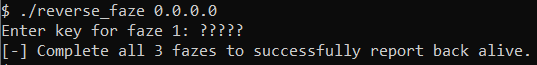
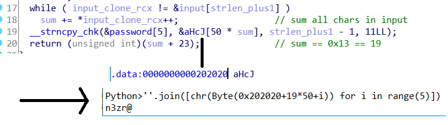

# Cyberthon: 操作系统

## Reverse(Faze) [1000]

_The hacker left a binary executable behind in ShoppingBaba's server as a way to connect back to their C2 server's ssh service at p7ju6oidw6ayykt9zeglwyxired60yct.ctf.sg:16382_

_Please help to find the credentials left behind inside the binary executable and find the flag on the hacker's server!_

**文件**: [reverse_faze](https://api.csdc20f.ctf.sg/file?id=ck8zooi6o00p207762gfblm2r&name=reverse_faze)

### 腾飞

<i>Regex有时会让人眼眶发酸。</i>

我们跳过描述，直接进入Hex-Rays。

为了让代码更易读，我特意重命名了几个变量。

这个二进制是一个简单的 crackme，有3+1个不同的`fazes`。首先，我们通过`argv`传递一个有效的 IP 来进入第一阶段:

在这段代码上运行:

通常情况下，你会用像`angr`这样的东西来逃避手动RE^1^的繁琐。但是，我的团队在比赛时时间比较紧张，二进制的时间很短，一小时内就能看完:

<b>AN:</b> <i>非线上缓冲的挑战真的很烦人，真的很烦人</i>

通过这三个函数后，只要粗略地乱码N次，就能在`gdb`中找到ssh凭证 (`hacker:N6#J%...`):

现在，盒子里的那个密码其实并**不正确**。我一直不明白为什么PEDA会把密码弄错，但你可以通过检查`faze2()`和查询IDAPython的正确值来手动纠正:

我在这里压缩了一个更复杂的解释，但本质上，这是从`gdb`中找到的密码中的`nrd12`字符变成了`n3zr@`，使得最终的密码为`N6#J%n3zr@MZjHU`。

有什么困惑吗？我也是，但是能用的都能用。

## Flag

`Cyberthon{isnt_this_really_ezaf?}`

## Footnotes

1. 这并不是说我没试过，我试过了，而且很快就复杂了。